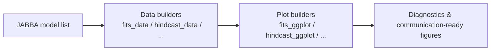

# JAGGview

> Static and dynamic visualization tools for interpreting model outputs generated by **JABBA**.


---

## Overview

**JAGGview** is an R package for preparing and plotting key diagnostics and results from JABBA model workflows.

The package includes functions to:

- prepare structured data from model output (e.g., fits, hindcast, retrospective, trajectories, Kobe, priors/posteriors, run tests);
- create publication-ready `ggplot2` visualizations for each analysis component;
- format numeric values with consistent decimal and SI-prefix presentation.

---

## Illustration



---

## Installation

### Option 1: Install from GitHub

```r
install.packages("remotes")
remotes::install_github("<owner>/JAGGview")
```

> Replace `<owner>` with the GitHub organization or username hosting this repository.

### Option 2: Install from a local clone

```r
install.packages("remotes")
remotes::install_local(".")
```

---

## How to use

### 1) Load the package

```r
library(JAGGview)
```

### 2) Prepare data from JABBA model objects

```r
# list_models should contain fit objects returned by JABBA::fit_jabba()
fits_df <- fits_data(list_models)
```

### 3) Create a plot

```r
p <- fits_ggplot(fits_df, palette = "#4285f4", title_y = "Abundance index")
print(p)
```

### 4) Example with other modules

```r
hc_df <- hindcast_data(list_models)
hc_plot <- hindcast_ggplot(hc_df)
print(hc_plot)
```

---

## Exported function groups

- **Fits:** `fits_data()`, `fits_ggplot()`
- **Hindcast:** `hindcast_data()`, `hindcast_ggplot()`
- **Kobe:** `kobe_data()`, `kobe_ggplot()`
- **Priors vs posteriors:** `priors_posteriors_data()`, `priors_posteriors_ggplot()`
- **Retrospective:** `retrospective_analysis_data()`, `retrospective_analysis_ggplot()`
- **Run tests:** `runs_tests_data()`, `runs_tests_ggplot()`
- **Trajectories:** `trajectories_data()`, `trajectories_ggplot()`
- **Formatting helper:** `international_system_prefixes()`

---

## Testing

```r
testthat::test_dir("tests/testthat")
```

---

## License

Licensed under **CC BY-NC-SA 4.0**.
