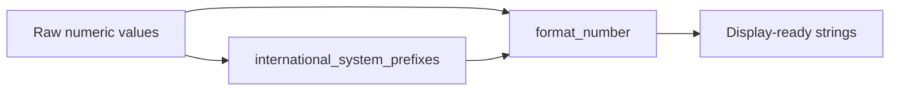

# JAGGview

> Static and dynamic visualization tooling for interpreting model outputs generated by **JABBA**, with utilities for numerical formatting and SI-prefix presentation.


---

## 📌 Overview

**JAGGview** is an R package focused on helping users explore and communicate model outputs from JABBA workflows.

At this stage of development, the package contains foundational utilities for:

- formatting numbers for clean presentation;
- converting values to International System (SI) prefixes for compact labels;
- supporting future static and Shiny-based model result visualizations.

The package description indicates the broader intended scope includes fit diagnostics, run tests, CPUE conflicts, process error views, prior-vs-posterior comparisons, retrospective analyses, trajectories, Kobe plots, and sensitivity analyses.

---

## ✨ Current Features

### 1) `format_number()`
Formats one or more numeric values using configurable decimal precision and separators.

**Arguments**

- `number`: numeric value or vector.
- `decimals`: number of decimal places (default: `2`).
- `big.mark`: thousands separator (default: `","`).
- `decimal.mark`: decimal separator (default: `"."`).

**What it does**

- rounds values to the desired precision;
- disables scientific notation for readability;
- supports locale-like formatting via separators.

---

### 2) `international_system_prefixes()`
Formats values using SI prefixes for compact display (`M`, `k`, `m`, `µ`, `n`).

**Arguments**

- `number`: numeric value or vector.
- `decimals`: decimal places in the formatted output (default: `2`).

**What it does**

- rescales values according to magnitude;
- appends the corresponding SI suffix;
- reuses `format_number()` to keep output consistent.

---

## 🧭 Package Flow (Illustrated)



This flow shows how both user-facing formatting paths produce clean, publication-ready labels.

---

## 🚀 Installation

Because this package is currently in active development, install from a local clone for now.

```r
# In an R session from the repository root:
install.packages("devtools")
devtools::install_local(".")
```

---

## ✅ Testing

This package uses **testthat (edition 3)**.

Run tests with:

```r
testthat::test_dir("tests/testthat")
```

Current tests validate:

- expected formatting output;
- error behavior for invalid (character) inputs.

---

## 📁 Repository Structure

```text
JAGGview/
├─ R/
│  ├─ format_number.R
│  └─ international_system_prefixes.R
├─ man/
│  ├─ format_number.Rd
│  └─ international_system_prefixes.Rd
├─ tests/
│  └─ testthat/
│     ├─ test-format_number.R
│     └─ test-international_system_prefixes.R
├─ DESCRIPTION
└─ README.md
```

---

## 🗺️ Roadmap (from package intent)

Planned visualization capabilities include:

- fit diagnostics and run tests;
- CPUE conflict analysis and process error summaries;
- prior vs posterior comparison views;
- retrospective analyses;
- trajectories, Kobe plots, and sensitivity analyses;
- static outputs and Shiny-based interactive dashboards.

---

## 🤝 Contributing

Contributions are welcome during this early phase.

Suggested contribution areas:

- additional formatting and labeling helpers;
- visualization modules for JABBA outputs;
- documentation and reproducible examples;
- expanded test coverage.

---

## 📜 License

Licensed under **CC BY-NC-SA 4.0**.

