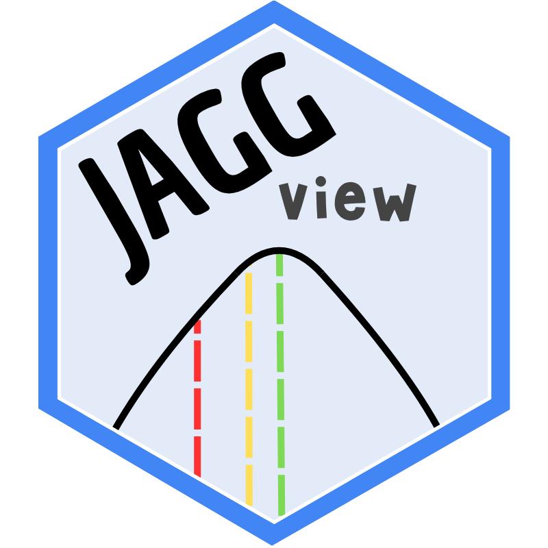
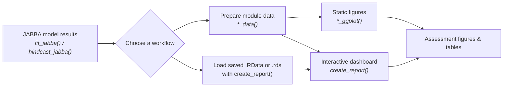

#  JAGGview

<br clear="left" />

> **An R toolkit and interactive dashboard for exploring results from [JABBA](https://github.com/jabbamodel/JABBA) stock-assessment models.**

[](https://www.r-project.org/)
[](https://shiny.posit.co/)
[](https://ggplot2.tidyverse.org/)
[](https://creativecommons.org/licenses/by-nc-sa/4.0/)

---

## Contents

- [What JAGGview does](#what-jaggview-does)
- [Workflow at a glance](#workflow-at-a-glance)
- [Installation](#installation)
- [Quick start](#quick-start)
- [Launch the interactive dashboard](#launch-the-interactive-dashboard)
- [Analysis modules](#analysis-modules)
- [Build static figures](#build-static-figures)
- [Useful extractors](#useful-extractors)
- [Input expectations](#input-expectations)
- [Testing](#testing)
- [License and authors](#license-and-authors)

---

## What JAGGview does

**JAGGview** turns fitted and hindcast objects produced by **JABBA** into structured data, publication-ready `ggplot2` charts, and an interactive `shiny`/`bs4Dash` report.

It is designed to help you move from JABBA output to a clear assessment narrative:

| Stage | JAGGview provides | Typical questions it helps answer |
| :-- | :-- | :-- |
| 🔧 **Prepare** | Standardized `*_data()` objects | What values and uncertainty should be plotted? |
| 📊 **Diagnose** | Fits, hindcast, residual, run-test, and retrospective views | Does the model describe the data consistently? |
| 🎯 **Interpret** | Trajectories, Kobe plots, priors vs. posteriors, and summary tables | What do the results imply for stock status and management? |
| 🖥️ **Communicate** | Customizable static plots and an interactive dashboard | How can results be reviewed and shared clearly? |

## Workflow at a glance



> **Two ways to work:** use the data-preparation and plot functions for a scripted, reproducible workflow, or use `create_report()` to review results in an interactive dashboard.

## Installation

### 1. System prerequisite: JAGS

JABBA uses JAGS through R interfaces such as `rjags`. Install JAGS for your operating system before installing the R packages.

<details>
<summary><strong>Ubuntu / Debian</strong></summary>

```bash
sudo apt update
sudo apt install jags
```
</details>

For other operating systems, install JAGS from the [official JAGS project](https://mcmc-jags.sourceforge.io/), then restart R if necessary.

### 2. Install JABBA and JAGGview from GitHub

Run the following in an R session:

```r
install.packages(c("remotes", "rjags", "R2jags"))

remotes::install_github("jabbamodel/JABBA")
remotes::install_github("UNIVALI-LEMA/JAGGview")
```

To install a particular development branch, append `@branch_name`:

```r
remotes::install_github("UNIVALI-LEMA/JAGGview@branch_name")
```

### 3. Install from a local clone

```r
remotes::install_local(".")
```

## Quick start

Load the package and prepare a fitted-index plot from one or more JABBA fit objects. `list_fit_models` below is a list of objects returned by `JABBA::fit_jabba()`.

```r
library(JAGGview)

# Convert JABBA fit output into the data required by the plotting function.
fits <- fits_data(list_fit_models)

# Create a ggplot2 object with observed indices and 80% / 95% intervals.
p <- fits_ggplot(
  fits,
  palette = "#2C7FB8",
  title_y = "Abundance index"
)

print(p)
```

For a hindcast workflow, pass a list of objects produced by `JABBA::hindcast_jabba()`:

```r
hindcast <- hindcast_data(list_hc_models)
hindcast_plot <- hindcast_ggplot(hindcast)
print(hindcast_plot)
```

## Launch the interactive dashboard

`create_report()` assembles an interactive Shiny dashboard with the available diagnostics and result views. It supports two input patterns.

### Option A — Load saved JABBA results

Give the function one or more `.RData` or `.rds` files. JAGGview identifies compatible fit and hindcast objects, prepares the necessary data, and opens the report.

```r
library(JAGGview)

create_report(
  filename = "model_results.RData",
  dir = "path/to/results",
  animation = TRUE,
  verbose = TRUE
)
```

### Option B — Supply precomputed JAGGview data

This is useful when you want full control over preprocessing or already have the objects in memory.

```r
fits <- fits_data(list_fit_models)
hind <- hindcast_data(list_hc_models)
kobe <- kobe_data(list_fit_models)
priors_posteriors <- priors_posteriors_data(list_fit_models)
retrospective <- retrospective_analysis_data(list_hc_models)
runs <- runs_tests_data(list_fit_models)
trajectories <- trajectories_data(list_fit_models)

create_report(
  fits_data = fits,
  hind_data = hind,
  kobe_data = kobe,
  pp_data = priors_posteriors,
  ra_data = retrospective,
  res_data = runs,
  traj_data = trajectories,
  animation = FALSE
)
```

### Dashboard guide

| Area | What you can inspect |
| :-- | :-- |
| **Fits** | Observed abundance indices, fitted values, and 80% / 95% credibility intervals. |
| **Runs Tests** | Residual run-test diagnostics across model scenarios. |
| **CPUE Residuals** | Residual patterns, smooth trends, and RMSE annotations. |
| **Priors × Posteriors** | Prior and posterior distributions for carrying capacity (`K`), intrinsic growth rate (`r`), and initial depletion (`psi`). |
| **Retrospective Analysis** | Biomass, fishing mortality, B/Bmsy, F/Fmsy, process error, and surplus-production peels. |
| **Hindcast** | Observed versus predicted hindcast values and MASE performance measures. |
| **Trajectories** | BB0, BBmsy, FFmsy, biomass, harvest rate, catch, and biomass-deviation views. |
| **Kobe** | Stock-status trajectories relative to biomass and fishing-mortality reference points. |

## Analysis modules

Every major analysis follows the same simple pattern: **prepare data** with a `*_data()` function, then **plot it** with the matching `*_ggplot()` function.

| Module | Prepare | Visualize | Focus |
| :-- | :-- | :-- | :-- |
| Fitted indices | `fits_data()` | `fits_ggplot()` | Observations, fitted index, and credibility intervals. |
| Hindcast | `hindcast_data()` | `hindcast_ggplot()` | Predictive performance and Mean Absolute Scaled Error (MASE). |
| Kobe | `kobe_data()` | `kobe_ggplot()` | Biomass and fishing-mortality status relative to reference points. |
| Priors vs. posteriors | `priors_posteriors_data()` | `priors_posteriors_ggplot()` | How model fitting updates `K`, `r`, and `psi`. |
| Retrospective analysis | `retrospective_analysis_data()` | `retrospective_analysis_ggplot()` | Peel behavior and retrospective-bias diagnostics. |
| Runs tests | `runs_tests_data()` | `runs_tests_ggplot()` | Residual structure by scenario. |
| CPUE residuals | `runs_tests_data()` | `cpue_residuals_ggplot()` | Residual time series, trend, and RMSE. |
| Trajectories | `trajectories_data()` | `trajectories_ggplot()` | Core biomass, harvest, catch, and ratio trajectories. |

Most plotting functions return a `ggplot` object. Adjust labels, palettes, axis limits, facet layout, and other parameters in the corresponding function call, then add normal `ggplot2` layers or save the result with `ggplot2::ggsave()`.

## Build static figures

A compact example for a reproducible analysis script:

```r
library(JAGGview)
library(ggplot2)

# 1. Prepare data from JABBA model fits.
trajectory_data <- trajectories_data(list_fit_models)

# 2. Create a chart. See ?trajectories_ggplot for available options.
trajectory_plot <- trajectories_ggplot(trajectory_data)

# 3. Save a high-resolution figure.
ggsave(
  filename = "trajectory.png",
  plot = trajectory_plot,
  width = 10,
  height = 6,
  dpi = 300
)
```

## Useful extractors

JAGGview also includes convenience functions for incorporating result summaries into your own analyses, tables, or reports.

| Function | Returns |
| :-- | :-- |
| `get_mase(hindcast_data)` | Hindcast MASE values by index and scenario. |
| `get_pars(list_fit_models)` | Parameter estimates from fitted JABBA models. |
| `get_ppmr(priors_posteriors_data)` | Posterior probability metric results. |
| `get_ppvr(priors_posteriors_data)` | Posterior probability variable results. |
| `get_refpts(list_fit_models)` | Reference points from fitted models. |
| `get_rho(retrospective_analysis_data)` | Retrospective-bias (`rho`) metrics. |
| `summary_table(...)` | A formatted summary table for reporting. |

## Input expectations

- **Fit-based functions** accept a JABBA fitted-model object or a list of fitted objects returned by `JABBA::fit_jabba()`.
- **Hindcast-based functions** accept a JABBA hindcast object or a list of hindcast objects returned by `JABBA::hindcast_jabba()`.
- A list lets you compare **scenarios** in the same visualization.
- Functions that prepare data return structured objects used directly by their paired plotting functions and by `create_report()`.
- The report loader accepts saved `.RData` and `.rds` files; unrelated objects in those files are ignored.

## Testing

From the repository root, run the test suite with:

```r
testthat::test_dir("tests/testthat")
```

Or, for the standard package-development workflow:

```r
devtools::test()
```

## License and authors

JAGGview is distributed under the [Creative Commons Attribution–NonCommercial–ShareAlike 4.0 International License](https://creativecommons.org/licenses/by-nc-sa/4.0/).

**Authors:** Thiago Pacheco (creator) and Rodrigo Sant'Ana.

---

<p align="center">
  Built to make <strong>JABBA</strong> model results easier to inspect, explain, and share.
</p>
